<!-- Simple Banner with Logo -->

  

<!-- Quick Links with Professional Badges -->

  <!-- Portfolio Badge - Navy Blue -->
  
  
  <!-- Resume Badge - Deep Purple -->
  
  
  <!-- GitHub Badge - Dark Gray -->
  

<!-- Social Links with Profile View Count -->

  
  
  

<!-- Compact Side by Side GIFs -->

  
  

## 📊 GitHub Stats

  <!-- Stats Card -->
  

    
STATS

    
  

  
  <!-- Languages Card -->
  

    
LANGUAGES

    
  

  
  <!-- Streak Card -->
  

    
STREAK

    
  

  
  <!-- Trophies Card -->
  

    
TROPHIES

    
  

<!-- Activity Graph -->

  

## 👋 About Me

  
Hello! I'm Naresh Rana, a Computer Science and Engineering graduate with expertise in Full-stack Development, AI/ML, and DevOps. I'm passionate about building innovative solutions and continuously expanding my technical knowledge. With hands-on experience in both development and operations, I bridge the gap between software development and IT operations to deliver efficient, scalable solutions.

## 🛠️ Technical Skills

### Programming Languages

  
  
  
  
  

### Web Development

  
  
  
  
  
  
  
  
  

### Databases & Storage

  
  
  
  
  

### AI/ML & Data Science

  
  
  
  
  
  
  
  

### DevOps & Cloud

  
  
  
  
  
  
  
  
  
  

### Tools & IDEs

  
  
  
  
  
  
  
  

## 🎵 Now Playing

  

## 💼 Professional Experience

### 🤖 AI - DevOps Engineer
**Aitch Nu Global Technologies** | *2024*  
  
- Built and maintained CI/CD pipelines for efficient deployments  
- Automated server setup and infrastructure tasks to save time  
- Managed cloud environments to ensure high availability and scalability  
- Integrated AI models into production systems for real-time applications  
- Collaborated with developers to troubleshoot and optimize system and software performance  

**Tech Stack**: 

---

### 🧠 Machine Learning Trainee (Intern)
**SkillDzire** | *2025*  
  
- Developed ML models for YOLOv8 object detection, heart disease prediction, and COVID-19 data analysis  
- Applied Python, Pandas, NumPy, scikit-learn, and OpenCV to preprocess data and train models  
- Worked on real-world datasets to build and optimize machine learning models  
- Created detailed reports and visualizations to communicate findings  

**Tech Stack**: 

---

### 🔧 IT Support & Networking Technician
**Store-Based Service** | *2015 – 2016*  
  
- Set up and configured computers and programs, including operating systems and software installation  
- Troubleshot and fixed hardware and network problems, maintaining system efficiency  
- Assembled and built computer systems from individual components  
- Provided technical support and maintenance for hardware and software issues  

**Tech Stack**: 

---

## 🏆 Certifications & Achievements

- 🤖 **Machine Learning** – SkillDzire
- 🤖 **AI - DevOps Engineer** – Aitch Nu Global Technologies
- 🔌 **Fiber Optic Communication System** – Skill India (Ministry of Skill Development & Entrepreneurship)
- 🖥️ **Hardware and Networking** – Certified Professional
- 💻 **Diploma in Computer Application Basics - MS Office**

---

## 🌐 Languages & Communication

  
  
  
  
  

